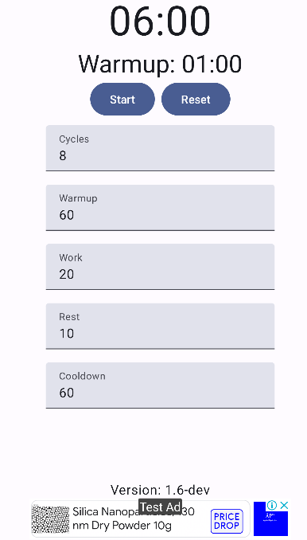

# Marshall's Metronome: Tabata Timer for Android

[Download](https://github.com/wizzardx/MarshallsMetronome/releases)

Introducing "Marshall's Metronome," a personalized Tabata Timer Android app, crafted to meet the specifications requested by Marshall. This app simplifies the execution of [Tabata](https://en.wikipedia.org/wiki/High-intensity_interval_training#Tabata_regimen) workouts, a form of high-intensity interval training renowned for its efficiency and effectiveness.

## Sneak Peek of the App:

## App Features:

- **Custom Timers**: Set and modify the Tabata intervals to your liking, with the ability to adjust the high-intensity and rest durations.
- **Configurable Sets**: Personalize the number of rounds to suit your workout intensity needs.
- **Seamless Operation**: Commence workouts with the 'Start' button, which transforms into 'Pause' and 'Resume' during the exercise for effortless session management.
- **Quick Reset**: Conveniently stop the ongoing workout and revisit the setup screen to adjust your workout parameters.
